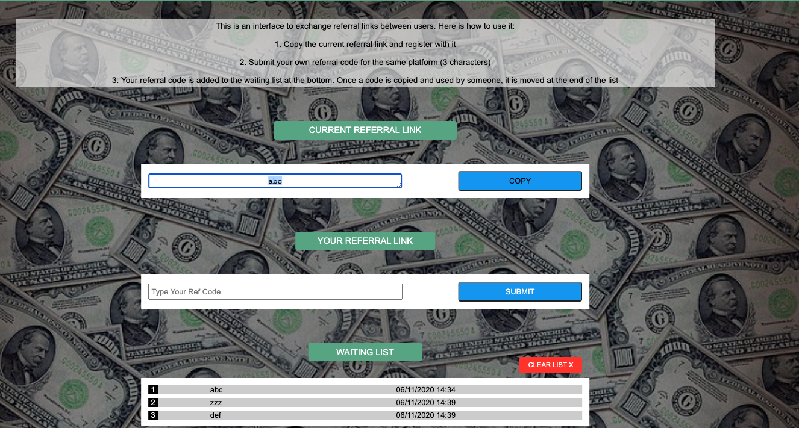

# Referrals Waiting List

Pure vanilla JavaScript project, inspired from my own experience with referral links.

### Concept

It's the 1st iteration of a platform for strangers to fairly exchange referral links (on Amazon, Uber, etc). The goal is to create a virtuous circle for the ones using my website; they become affiliates of someone else by using a link on the platform and then they can submit their own referral link that will get them referrals when it reaches the top of the list.

The challenge is to make sure people actually register with the "current" referral link (n°1 on the list) before submitting theirs. It's also mandatory to implement some sort of waiting system. In my case, I've decided to go for an ordered list. If you copy & use the top link and submit your own, your link is added at the end of the list and the link that was at the top is pushed to the bottom, below yours, because it got a new affiliate.
This way, everyone benefits from it over time.

The system isn't complete because I don't check for real if the ref' link was registered with on a specific platform. I'm also using LocalStorage to save links which is obviously not okay for production.
